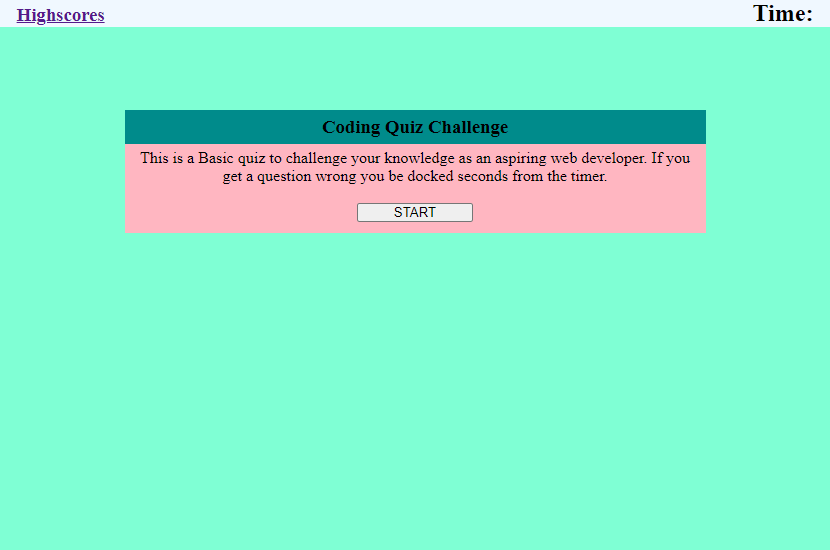

# Coding Quiz 

Repository contains quality readme file with description, screenshot, and link to deployed application.

```
GIVEN I am taking a code quiz
WHEN I click the start button
THEN a timer starts and I am presented with a question
WHEN I answer a question
THEN I am presented with another question
WHEN I answer a question incorrectly
THEN time is subtracted from the clock
WHEN all questions are answered or the timer reaches 0
THEN the game is over
WHEN the game is over
THEN I can save my initials and my score
```


#### With the increase in demand for online security, having a strong password that meets certain criteria is becoming increasingly important. 

[Coding Basic's Quiz](https://b-alt-del.github.io/Coding-Quiz/) is a web application built to test your basic coding knowledge.


